# Build plan — our own Demo Hub

What we're building: a weekly video-demo hub like
[docs.omni.co/demos](https://docs.omni.co/demos), for **our** product and team, with our own
content and branding. We replicate the *system* (program, pages, feed, pipeline), not Omni's
videos or text.

Read first: [01 — how Omni's works](01-how-omni-demos-works.md) ·
[02 — open-source landscape](02-open-source-landscape.md) · Companion: [04 — test plan](04-test-plan.md)

## TL;DR

- **Stack:**
  - An **Astro Starlight** static site (MIT). The weekly pages are **generated from one YAML file
    per week**, which is the single source of truth.
  - A **TypeScript drafting pipeline** in GitHub Actions: YouTube metadata → transcript → Claude
    summary and tags → a **PR for human review** → publish.
  - A throwaway spike already confirms the site architecture
    ([`research/spike-starlight/`](../research/spike-starlight/)).
- **Omni parity plus fixes for its weaknesses:**
  - Omni's layout: index with "latest" callout and Subscribe, year archives, weekly pages with a
    TOC, and RSS.
  - What we fix: a controlled tag list, a people registry, RSS that links to weekly pages,
    lightweight video embeds, transcripts, stable permalinks, and a sensitive-content gate.
- **Effort:** about **17–24 engineer-days**, roughly 4 weeks for one engineer or about 3 weeks
  for two (site and pipeline in parallel). After launch, about 30 minutes of editor time a week.
- **Running cost:** about **$0–10/month**. Static hosting and YouTube are free. Claude
  summaries cost roughly $0.02–0.04 per demo, which is under $5/month at 20 demos a week.
- **Next step:** confirm the decisions in section 2, or accept the defaults, then start Phase 0.

---

## 1. Scope

### 1.1 Parity with Omni (v1 must-haves)

| Omni feature | Our implementation | Phase |
|---|---|---|
| `/demos` index: one entry per week with a sticky date label and hover anchor | `WeekEntry` component, generated from data | 1 |
| "Check out the latest demo!" callout | `LatestCallout`, **generated** from the newest week | 1 |
| Subscribe button + RSS tip | `SubscribeButton` (copy feed URL, "add to Slack" instructions) | 1–2 |
| Year archive pages (`/demos/2026`) | `src/pages/demos/[year]/index.astro` | 1 |
| Sidebar: "All demos" + year groups (current year expanded) | Generated from data in `astro.config.mjs` (proven in the spike) | 1 |
| Weekly page: date title, headline description, disclaimer, one H2 per demo, byline, summary, video | `src/pages/demos/[year]/[date].astro` + `DemoSection` | 1 |
| Right-hand TOC of demos | `<StarlightPage headings>` (proven in the spike) | 1 |
| RSS feed | `src/pages/demos/rss.xml.ts` (`@astrojs/rss`) | 2 |
| Full-text search including demos | Pagefind, built in (proven in the spike) | 2 |
| Dark mode, responsive layout, prev/next pagination | Starlight built-ins | 1 |
| Per-page OG images | Build-time image generation (for example `astro-og-canvas`) | 2 |
| `.md` export per page, `llms.txt`, `llms-full.txt` | Our own endpoints (`starlight-llms-txt` ignores data pages) | 2 |
| Sitemap, canonical, meta description | Starlight + `@astrojs/sitemap` | 2 |
| Analytics | Plausible or GA4 | 2 |
| Page feedback (thumbs) | Small component that sends an analytics event | 5 |

### 1.2 Improvements over Omni (from the teardown)

| Omni's weakness | Our fix | Phase |
|---|---|---|
| 4 files edited per week | 1 YAML file per week; everything else is generated | 1 |
| Free-text tags (145 spellings of 116 tags) | `tags.yml` taxonomy with aliases; unknown tags fail the build | 1 |
| Free-text presenter names | `people.yml` registry; unknown presenters fail the build (proven) | 1 |
| RSS keeps only the last 15 items and links to index anchors | Configurable item count (default 50), each linking to the weekly page, with a stable `guid` | 2 |
| Up to 34 full YouTube iframes per page | Lite-YouTube facade (`youtube-nocookie.com`, loaded on click) | 1 |
| No transcripts | Collapsible transcript per demo; included in search and `llms-full.txt` | 3 |
| Permalinks lost in two migrations | Stable `/demos/YYYY/YYYYMMDD/` + `redirects.yml` with a CI test | 1 |
| Customer data sometimes on screen | Pipeline `sensitive` flag + review checkbox; videos stay Unlisted until the PR merges | 3–4 |

### 1.3 Not in v1 (Phase 6 backlog)
- AI "Ask the demos" chat.
- Per-demo permalink pages.
- Tag and presenter filter pages.
- Email digest.
- Screen-content scanning with vision.
- Keystatic editing UI.
- A separate text changelog (Omni runs one next to demos).

## 2. Decisions to confirm (defaults in bold)

| # | Decision | Default | Why | Alternatives |
|---|---|---|---|---|
| D1 | Platform | **Astro Starlight (open source)** | Full control, testable static output, free hosting, Zod validation; proven in the spike | Mintlify (exact Omni parity, fastest start; see section 10), Fumadocs, Docusaurus |
| D2 | Video host | **YouTube: Unlisted until merge, Public on publish** | Free and captioned; mirrors Omni. Uploads happen in YouTube Studio, so no API upload audit is needed | Cloudflare Stream (≈ $5–15/month, API upload, free captions) if videos must stay internal or off YouTube |
| D3 | Audience | **Public** (like Omni) | RSS works in Slack and readers without auth | Internal-only: Cloudflare Access in front of the site, plus a Slack webhook (private RSS won't work in Slack) |
| D4 | URL | **`/demos/YYYY/YYYYMMDD/`** on our docs domain | Same scheme as Omni; readable and date-sortable | `demos.<domain>` subdomain |
| D5 | Metadata source | **YouTube title `YYYY-MM-DD Demo title` + `Presenter: Name` as the first line of the description**; tags suggested by the LLM and fixed in review | Near-zero friction for presenters | A submission form (Google Form or Slack workflow) → sheet |
| D6 | Transcript source | **YouTube captions via the owner's OAuth**, if the Phase 0 check passes; otherwise **faster-whisper on the source clip** | Avoids an extra upload step if captions work | Cloudflare Stream or Mux captions API |
| D7 | Cadence / SLA | **Demos Friday → draft PR Saturday → published by Monday noon** | Matches Omni's observed 1–4 day lag | Same-day publish with a stricter review rota |
| D8 | Language | **TypeScript (Node 22 LTS)** for site and pipeline; Python only in the Whisper step | One toolchain; the pipeline reuses the site's Zod schemas | All-Python pipeline |
| D9 | LLM | **Claude API, `claude-opus-5-5`**, structured outputs | Best quality at a negligible cost at this volume | Model is a config value; the eval suite (test plan section 6) decides any change |

## 3. Architecture

```mermaid
flowchart LR
  subgraph fri["Friday"]
    P["Presenters / host<br/>record clips"] -->|"YouTube Studio, Unlisted,<br/>YYYY-MM-DD Title"| YT[("YouTube channel")]
  end
  subgraph draft["draft-week.yml (Saturday cron or manual)"]
    YT -->|"playlistItems.list + videos.list (OAuth)"| M["Collect the week's videos"]
    M --> T["Transcripts<br/>captions or faster-whisper"]
    T --> S["Claude: summary, tags,<br/>sensitive flags"]
    S --> H["Claude: week headline"]
    H --> G["Write week YAML<br/>+ transcripts"]
    G --> PR["Open PR + preview deploy"]
  end
  PR -->|"editor reviews checklist, merges"| MAIN[("main")]
  MAIN --> CI["CI: validate, build, test"]
  CI --> DEP["Deploy static site"]
  DEP --> PUB["publish-week.yml:<br/>videos Public,<br/>descriptions synced"]
  DEP --> RSS["RSS feed → Slack, readers"]
```



### 3.1 Repository layout

```
.
├── astro.config.mjs                 # Starlight config; sidebar generated from src/content/demos
├── src/
│   ├── content.config.ts            # collections: docs, weeks, people, tags (Zod)
│   ├── content/demos/2026/20260925.yaml      # ← one file per week (source of truth)
│   ├── content/transcripts/2026/20260925/deploy-previews.vtt
│   ├── data/people.yml  data/tags.yml  data/redirects.yml
│   ├── components/  WeekEntry · LatestCallout · SubscribeButton · DemoSection · Byline · Transcript
│   ├── lib/         weeks.ts · feed.ts · markdown.ts · sidebar.mjs · slug.ts
│   └── pages/
│       ├── demos/index.astro                  # /demos/
│       ├── demos/[year]/index.astro           # /demos/2026/
│       ├── demos/[year]/[date].astro          # /demos/2026/20260925/
│       ├── demos/[year]/[date].md.ts          # /demos/2026/20260925.md
│       ├── demos/rss.xml.ts                   # /demos/rss.xml
│       ├── llms.txt.ts · llms-full.txt.ts
│       └── og/[...path].png.ts                # social cards
├── pipeline/
│   ├── src/  cli.ts · youtube.ts · transcripts/{youtube-captions,whisper}.ts · summarize.ts · headline.ts · generate.ts · publish.ts
│   ├── prompts/  summarize.md · headline.md
│   ├── whisper/  transcribe.py · requirements.txt     # faster-whisper
│   └── evals/    promptfooconfig.yaml · cases/
├── tests/  unit/ · content/ · build/ · e2e/ · fixtures/
└── .github/workflows/  ci.yml · evals.yml · draft-week.yml · publish-week.yml · deploy.yml · healthcheck.yml
```

### 3.2 Content model (the source of truth)

`src/content/demos/2026/20260925.yaml`:

```yaml
date: 2026-09-25                  # demo day; the file path must match
headline: Deploy previews for every PR, clarifying questions in the assistant, and more
publishedAt: 2026-09-28T14:40:00Z # feeds use this as pubDate
draft: false
demos:
  - slug: deploy-previews         # H2 anchor: /demos/2026/20260925/#deploy-previews
    title: Deploy previews for every PR
    presenters: [ana-li]          # → people.yml (unknown IDs fail the build)
    tags: [developer-productivity] # → tags.yml (1–4, unknown IDs fail the build)
    summary: >-
      Ana shows how every pull request now gets its own preview URL, posted as a PR
      comment within a few minutes of pushing.
    video: { provider: youtube, id: demo0000001, durationSeconds: 184 }  # placeholder ID
    transcript: 2026/20260925/deploy-previews.vtt   # optional
    review:
      sensitive: none             # none | flagged | cleared  (flagged blocks merge)
      generatedBy: pipeline@0.3.0 # provenance; removed or kept after human edits
```

`src/data/people.yml` holds `{id, name, team, avatar?}`. `src/data/tags.yml` holds
`{id, label, description, aliases[]}`; the descriptions help the LLM choose tags.

Zod schema (extends the spike's `src/content.config.ts`): `z.object({...}).strict()` so a typo
in a field name fails, and `reference('people')` and `reference('tags')` for referential integrity.
Invariants a schema can't express (the path matches the date, no duplicate video IDs across the
archive, the Friday warning) live in `tests/content/` (test plan section 3.2).

### 3.3 Pages and URLs

| URL | Source | Notes |
|---|---|---|
| `/demos/` | `pages/demos/index.astro` | Intro, Subscribe, LatestCallout, all weeks newest first (`tableOfContents: false`) |
| `/demos/2026/` | `pages/demos/[year]/index.astro` | That year's weeks |
| `/demos/2026/20260925/` | `pages/demos/[year]/[date].astro` | `<StarlightPage headings={demos}>` |
| `/demos/2026/20260925.md` | `pages/demos/[year]/[date].md.ts` | Markdown export (`<link rel="alternate" type="text/markdown">`) |
| `/demos/rss.xml` | `pages/demos/rss.xml.ts` | 50 newest weeks; link and guid = weekly permalink |
| `/llms.txt`, `/llms-full.txt` | endpoints | full-txt includes summaries **and transcripts** |
| `/og/demos/2026/20260925.png` | endpoint | 1200×630, title + headline + year |
| old URLs | `data/redirects.yml` → Astro `redirects` | CI test: every redirect target exists |

### 3.4 The drafting pipeline

`npm run demo:draft -- --week 2026-09-25 [--dry-run] [--from-fixtures dir] [--force]`

1. **Collect.** OAuth as the channel owner (refresh token stored as a GitHub secret). Page through
   the channel's uploads playlist (`playlistItems.list`, 1 unit per 50 items). Keep videos titled
   with the week's date. `videos.list` (1 unit) gets the description, duration and status.
   - Parse `Presenter:` and map it to `people.yml`; an unknown name becomes a PR warning.
   - Check that every video exists and is Unlisted or Public.
2. **Transcribe** through an adapter (D6):
   - `youtube-captions`: `captions.list` (50 units), prefer the `standard` track over `asr`, then
     `captions.download` as VTT (200 units).
   - `whisper`: faster-whisper `small`, int8, CPU, on the source clip.
   - Output: VTT plus plain text.
3. **Summarise** each demo with Claude (section 3.5). Output is validated against the shared Zod
   schema. A refusal or truncation becomes `needsHumanSummary: true` with a placeholder, never a
   crash.
4. **Headline.** One more Claude call turns the week's titles into a ≤ 140-character headline in
   Omni's style ("A, B, C, and more").
5. **Generate** the week YAML and transcript files.
   - Idempotent: a re-run never overwrites fields a human edited unless `--force` is passed.
   - Deterministic key order, for clean diffs.
6. **Open a PR** with `peter-evans/create-pull-request` using a **GitHub App token**, because PRs
   opened with `GITHUB_TOKEN` don't trigger CI. The PR includes:
   - the review checklist (test plan section 5),
   - a table of the demos with their flags,
   - the preview URL, and
   - the API quota and cost spent.

**Publish step** (`publish-week.yml`, runs after deploy on merge): `videos.update` (50 units
each) sets the week's videos **Public** and writes each description as summary + link to the
weekly page. That mirrors Omni's 9-second publish window and keeps YouTube and the site in sync.
If Phase 0 shows that unverified API projects can't change privacy, the runbook covers a 1-minute
bulk edit in YouTube Studio instead.

Quota for a 20-demo week: a few units (list) + 20 × 250 (captions) + 20 × 50 (update) ≈ **6,000
units**, under the default 10,000/day. Using the Whisper adapter drops it to about 1,000.

### 3.5 Summariser contract (Claude API)

Output schema (Zod, shared with the site):

```ts
const DemoDraft = z.object({
  title: z.string().max(60),                       // cleaned from the YouTube title
  summary: z.string(),                             // 25–60 words, checked client-side
  tags: z.array(z.enum(TAG_IDS)).min(1).max(4),    // TAG_IDS read from tags.yml at runtime
  sensitive: z.object({
    flagged: z.boolean(),
    reasons: z.array(z.enum(['customer_data', 'credentials', 'personal_data', 'internal_url', 'unreleased_partner', 'other'])),
  }),
  confidence: z.enum(['low', 'medium', 'high']),
});
```

Illustrative call (TypeScript SDK, documented `messages.parse` + `zodOutputFormat` pattern):

```ts
import Anthropic from '@anthropic-ai/sdk';
import { zodOutputFormat } from '@anthropic-ai/sdk/helpers/zod';

const client = new Anthropic();
const res = await client.messages.parse({
  model: 'claude-opus-5-5',
  max_tokens: 16000,
  system: [{ type: 'text', text: SYSTEM_PROMPT_WITH_TAXONOMY_AND_STYLE, cache_control: { type: 'ephemeral' } }],
  messages: [{ role: 'user', content: renderDemoInput({ title, presenter, transcript }) }],
  output_config: { format: zodOutputFormat(DemoDraft), effort: 'medium' },
});
if (res.stop_reason === 'refusal' || res.stop_reason === 'max_tokens' || !res.parsed_output) {
  return needsHumanSummary(demo);                  // placeholder + PR warning, never a crash
}
```

Settings and rules:
- **Refusal fallback:** turn on the server-side option (`fallbacks: "default"` with beta header
  `server-side-fallback-2026-07-01`). It's a beta-namespace parameter, so Phase 3 confirms the
  exact SDK binding alongside structured outputs. The Batches API rejects it; that's fine,
  because synchronous calls cost cents at this volume.
- **Prompt caching:** the system prompt (style guide + taxonomy + 3 examples) sits above Opus
  5.5's 512-token cache minimum. The ~20 calls in a weekly run then read it from cache.
- **Effort:** start at `medium` (Opus 5.5's default). Let the eval suite decide whether `low` holds
  quality; thinking can't be turned off on this model.
- **Style guide in the prompt:**
  - Third person and present tense.
  - Start with the presenter's first name ("Ana shows…").
  - State what's new and why it matters.
  - No superlatives, and never invent metrics.
  - If the transcript is thin, say less and set `confidence: low`.
- **Cost:** about 2.5k input and ≤ 1.5k output tokens per demo, at $4 and $20 per million
  tokens, comes to about $0.02–0.04 per demo, or **under $1 a week**.
- **Optional (Phase 6) screen check:** sample one frame every 15 s and ask Claude (vision) to flag
  visible customer data. That's about $0.10 per 5-minute video. Audio-only summaries **can't
  see the screen**, and Omni's pages show this risk is real.

### 3.6 Operating the weekly program

| When | Who | What |
|---|---|---|
| Thu | Host | Slack reminder; presenters sign up in a thread |
| Fri | Presenters | Demo session (recorded), or pre-recorded clips of 5 minutes or less. Each clip goes to YouTube Studio as **Unlisted**, titled `YYYY-MM-DD Title`, with `Presenter: Name` in the description |
| Sat 15:07 UTC | Bot | `draft-week.yml` opens the PR with preview (off the top of the hour, because GitHub delays those crons) |
| Mon AM | Editor | Watches or skims each clip, fixes summaries and tags, resolves `sensitive` flags, merges |
| On merge | Bot | Deploy → smoke tests → videos set Public → RSS updates → Slack channels pick it up |

**Presenter guidelines:**
- Sandbox data only.
- Say your name and the feature in the first 10 seconds.
- 1080p.
- 5 minutes or less.
- Say the status: experimental, beta or shipping.

**Disclaimer** on every page (like Omni's): "Demos show work in progress and are not a guarantee
of release."

**Takedown runbook:** set the video to Private, then do one of the following. Nothing is
deleted without a redirect.
- Delete the demo entry and redirect its anchor to the week page.
- Delete the whole week and redirect it to `/demos/`.

## 4. Step-by-step phases

Every step lists its tests. Test IDs refer to [04-test-plan.md](04-test-plan.md).

### Phase 0 — Decisions and foundations (1–2 days)
1. Confirm D1–D9 (section 2).
2. Create the repo skeleton and toolchain:
   - Node 22 LTS, npm workspaces (`site`, `pipeline`), TypeScript strict, ESLint and Prettier,
     Vitest, Playwright.
   - `CODEOWNERS`, a PR template, and branch protection on `main`.
3. `ci.yml` skeleton (lint → typecheck → unit → build) plus a preview-deploy target
   (Cloudflare Pages, Netlify or Vercel).
4. **Two 30-minute checks against a test channel (these settle D6 and the publish step):**
   - Can our OAuth client `captions.download` an **auto-generated** track on our own Unlisted
     video?
   - Can `videos.update` switch Unlisted to Public from our (unverified) API project?

   Record the answers in `docs/decisions.md`.
5. Create the Anthropic workspace and API key with a spend limit; add GitHub secrets
   (`ANTHROPIC_API_KEY`, `YT_CLIENT_ID/SECRET/REFRESH_TOKEN`, the GitHub App key).

**Done when:** CI is green on an empty Starlight site, and both Phase 0 checks are answered.

### Phase 1 — Content model and static site MVP (4–5 days)
1. Scaffold Starlight (pinned versions), using the spike as reference. Set up theme tokens: brand
   colours and fonts, light and dark.
2. Collections and schemas: `weeks`, `people`, `tags` (section 3.2). Write the **fixture weeks**
   from test plan section 2. → *Tests: section 3.2 C1–C11.*
3. Components:
   - `DemoSection`, `Byline`, `WeekEntry` (sticky date label + anchor)
   - `LatestCallout`, `SubscribeButton`, disclaimer Aside
   - lite YouTube via `@astro-community/astro-embed-youtube`, with an accessible play label

   → *Tests: section 3.4.*
4. Routes: `/demos/`, `/demos/[year]/`, `/demos/[year]/[date]/`. Generated sidebar, with the
   current year expanded. `redirects.yml` support. → *Tests: E1–E3, E6, E8, E10, E11.*
5. The video facade: verify there are **no YouTube requests until a click**. → *Tests: E4, E5.*
6. Accessibility baseline. → *Tests: section 3.7 (axe light and dark).*

**Done when:** all fixture weeks render with parity items marked "1" in section 1.1, CI gates
are green, and Lighthouse on `week-huge` scores ≥ 0.90.

### Phase 2 — Feeds, search, SEO, LLM surfaces (2–3 days)
1. `rss.xml.ts`: 50 items; link and guid = weekly permalink; `pubDate` = `publishedAt`;
   `content` = HTML list of the demos with anchors. Add a `<link rel="alternate">` in the head.
   → *Tests: section 3.5 RSS, 3.9.*
2. Pagefind:
   - Give demo titles a higher weight.
   - Give transcripts a lower weight.
   - Add a `data-pagefind-filter` for year and tags.

   → *Tests: E7.*
3. OG images, canonical URLs, sitemap, meta descriptions. → *Tests: section 3.5 OG and sitemap.*
4. `.md` export, `llms.txt` and `llms-full.txt` endpoints. → *Tests: section 3.5 markdown.*
5. Analytics (Plausible or GA4). If the tool sets cookies, add a consent notice.

**Done when:** the feed validates, a manual Slack `/feed subscribe` works against the preview
URL, and search finds a demo by title.

### Phase 3 — Drafting pipeline (5–7 days)
1. `youtube.ts`: OAuth client, pagination, quota accounting, retries. Record API fixtures.
   → *Tests: section 3.3 youtube, P5.*
2. Transcript adapters (`youtube-captions`, `whisper`; the default follows the Phase 0 result).
   Measure faster-whisper speed on our runner size and record it. → *Tests: section 3.3 transcribe.*
3. `summarize.ts` and `headline.ts`:
   - Prompts live in `pipeline/prompts/`.
   - Zod contract (section 3.5); refusal and max_tokens handling.
   - Confirm the fallback and structured-output binding against the SDK's examples.

   → *Tests: section 3.3 summarize.*
4. **Golden set and evals:** collect 25–30 of our own demo transcripts (record a few internal
   demos early if there's no archive yet). Write reference summaries, then run promptfoo.
   Pick the effort level from the results. → *Tests: section 6.*
5. `generate.ts`: YAML writer, idempotent merge, transcript files. → *Tests: P1–P3, golden files.*
6. CLI with `--dry-run` and `--from-fixtures`. Try one real week locally, end to end.

**Done when:** a real test week produces a correct draft PR locally, deterministic evals pass
100%, and faithfulness is ≥ 95%.

### Phase 4 — Automation and editorial workflow (2–3 days)
1. `draft-week.yml`:
   - Cron `7 15 * * 6` plus `workflow_dispatch(week)`.
   - Runs the pipeline and opens a PR via the GitHub App token, with labels and reviewers.
2. PR template with the editorial checklist; CODEOWNERS on `src/content/demos/**`.
3. `deploy.yml` (on main): build → deploy → post-deploy smoke tests (test plan section 7).
4. `publish-week.yml`: set videos Public and sync descriptions (or the manual fallback from
   Phase 0).
5. Runbook `docs/runbook.md`: weekly checklist, re-running a failed draft, adding a demo by hand,
   takedown, rotating secrets.

**Done when:** one full dry-run week is driven by a **non-engineer editor**, using only the
runbook.

### Phase 5 — Hardening and launch (3–4 days)
1. Performance budgets become required checks (test plan section 3.8). Visual-regression baselines
   (section 3.10).
2. Manual accessibility pass: keyboard, VoiceOver, NVDA.
3. Security headers and CSP:
   - `frame-src https://www.youtube-nocookie.com`
   - `img-src` includes `i.ytimg.com`
   - no inline scripts except hashed ones
4. `healthcheck.yml`: external links, **video availability via oEmbed**, feed validator,
   Lighthouse on production.
5. Backfill: import any existing demo recordings (`demo:draft --week` per past week, or a
   one-off importer).
6. Launch:
   - Add a nav link from the docs or site.
   - Subscribe the team Slack channels to the RSS feed.
   - Announce, and hold the first live Friday.

**Done when:** every required check is green on main, the launch checklist is complete, and the
first real week is published by the Monday SLA.

### Phase 6 — After launch (backlog, pick by demand)
- Tag filter UI (`?tags=`) and presenter pages.
- Per-demo permalink pages.
- Transcript with clickable timestamps.
- "Ask the demos": answers grounded in `llms-full.txt` or a small retrieval endpoint.
- Frame-based screen check.
- Email digest.
- Keystatic editing.
- Edit-rate dashboard (share of generated summaries that reviewers changed).

## 5. Timeline

| Week | One engineer | Two engineers (site ∥ pipeline) |
|---|---|---|
| 1 | Phase 0, Phase 1 | A: P0 + P1 · B: P0 checks, P3 steps 1–2 |
| 2 | Phase 2, start Phase 3 | A: P2 + P5 prep · B: P3 steps 3–6 |
| 3 | Phase 3 | A + B: P4, P5 → **launch end of week 3** |
| 4 | Phase 4, Phase 5 → **launch** | first two live weeks; tune prompts from edit rate |

Build the golden set early. The eval suite needs real transcripts, so hold 2–3 internal demo
recordings in week 1, even before the site exists.

## 6. Running costs (at about 20 demos a week)

| Item | Cost |
|---|---|
| Static hosting (Cloudflare Pages, Netlify or GitHub Pages free tier) | $0 |
| YouTube hosting and captions | $0 |
| Claude summaries and headlines | ~$2–4/month |
| Optional screen check (Phase 6) | ~$8/month |
| GitHub Actions | within free minutes for public repos; ~15 min/week of faster-whisper otherwise |
| Alternative video host (Cloudflare Stream, if D2 changes) | ~$5–15/month |

## 7. Risks

| Risk | Mitigation |
|---|---|
| Customer data or credentials on screen | Videos stay Unlisted until review; the `sensitive` flag must be resolved before merge (a CI check); presenter guidelines; takedown runbook; optional frame scan |
| YouTube API restrictions (unverified project, quota) | The pipeline only reads plus one privacy update. Phase 0 checks the unknowns; a manual Studio fallback is documented; start the API audit early if we want API uploads |
| LLM summaries invent details | Faithfulness evals, `confidence`, human review of every week, `needsHumanSummary` fallback |
| Scheduled job silently stops (GitHub disables crons after 60 days of inactivity on public repos) | Weekly merges keep the repo active; the healthcheck opens an issue if no draft PR exists by Sunday; manual dispatch |
| Bot PRs skip CI | GitHub App token for PR creation |
| Framework churn (Starlight is pre-1.0) | Pin exact versions; Renovate PRs must pass the full suite; visual regression catches layout drift |
| Link rot or deleted videos | Weekly oEmbed availability check opens issues |
| Permalinks lost on future migrations (Omni lost two generations of links) | URL scheme fixed in D4; `redirects.yml` with a CI test; never delete without a redirect |

## 8. Definition of done (v1)

- Every "Phase 1–2" row in section 1.1 is met, as shown by passing E2E, axe and build-output
  tests.
- A week goes from Friday recording to a Monday publish with **one human action** (review and
  merge).
- The required CI checks from test plan section 8 are enforced on `main`.
- Runbook written, and an editor has run a week unassisted.

## 9. Open questions for the team

1. Is the hub public (like Omni's) or internal-only? That changes D3, auth and notifications.
2. Do we already run docs on a platform (Mintlify, Docusaurus, …)? If we run Mintlify, section 10
   may beat a separate site.
3. Is there an archive of past demo recordings to backfill and to seed the eval golden set?
4. Who owns the Friday session (host) and the Monday review (editor)?
5. Brand: domain, logo, colours, fonts.

## 10. Alternative: build it on Mintlify (exact Omni parity)

If we already use Mintlify, or want the fastest path to an identical result:
1. Create a `demos/` section like Omni's (see [01](01-how-omni-demos-works.md) sections 2–3):
   - `demos/index.mdx` with `rss: true`, `mode: center`, `<Update>` entries and a `<Callout>`
   - `demos/YYYY/index.mdx` year pages
   - `demos/YYYY/YYYYMMDD.mdx` week pages
   - a "Product updates" tab → "Demos" menu in `docs.json`
2. Keep the YAML-per-week source of truth, but the pipeline's `generate.ts` renders the **4
   Mintlify files**: the week MDX, the index `<Update>` and Callout, the year list, and the
   `docs.json` navigation. Golden-file tests cover all four.
3. CI: `mint broken-links`, our content tests, and E2E, feed and Lighthouse checks against
   Mintlify's **preview URL** (test plan section 9).

Trade-offs:
- Pro: pixel-level parity and nothing to host.
- Pro: the AI assistant, if we pay for Pro ($450/month).
- Con: RSS is fixed at 15 items and links to anchors.
- Con: no lite-embed control and no build-time schema.
- Con: vendor lock-in (the renderer is closed; self-hosting is Enterprise-only).

Effort: about 75% of the Starlight plan (13–18 engineer-days). Phases 1–2 shrink from 6–8 days
to about 2; Phases 0 and 3–5 are unchanged.
